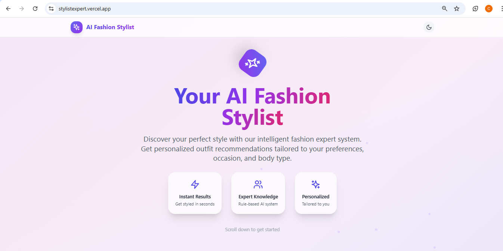
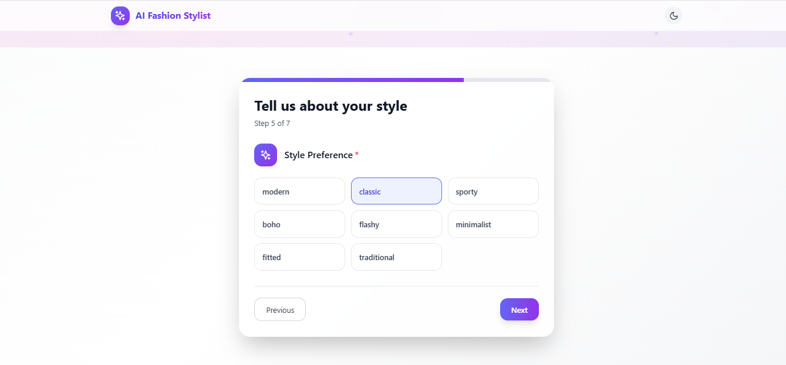
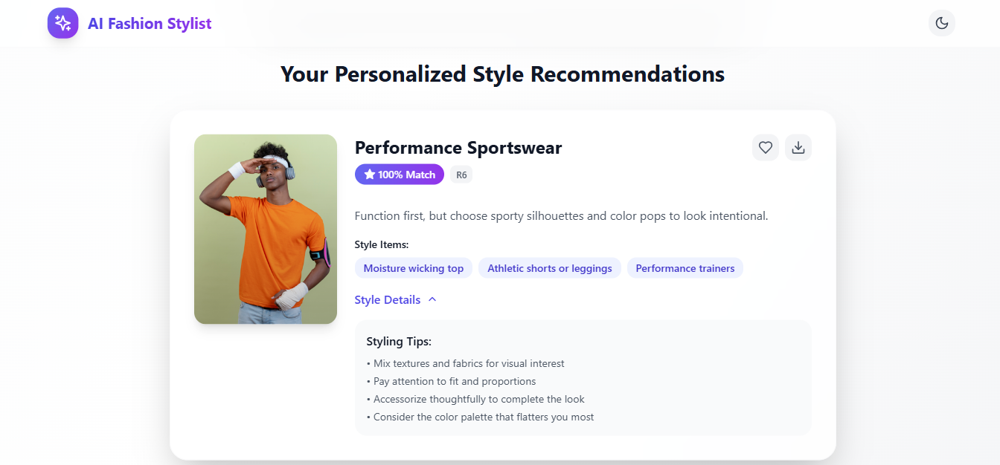
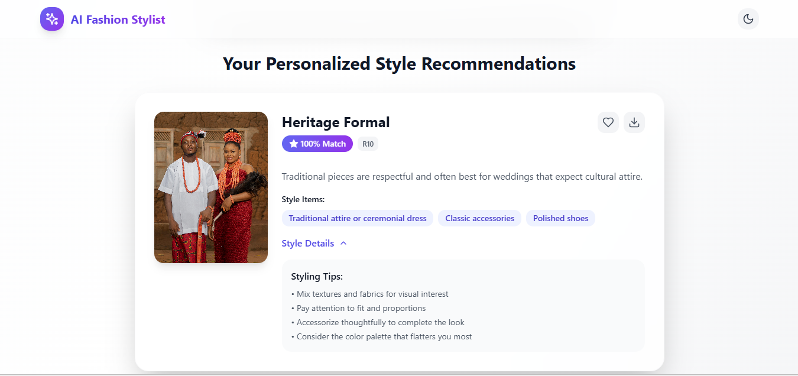
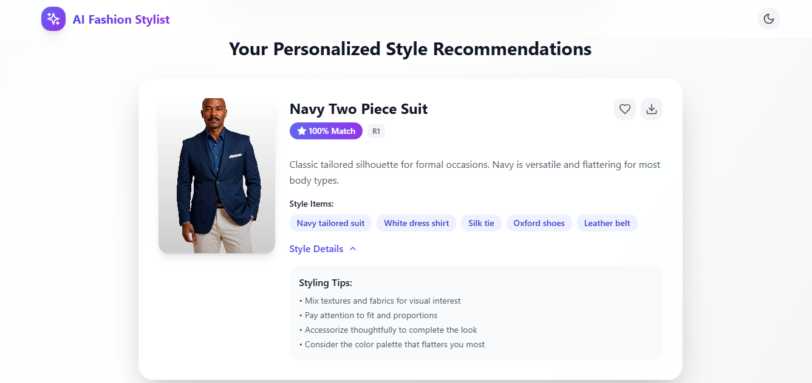

# 👗 StylistExpert Frontend

Welcome to the frontend of **StylistExpert**, an AI-powered fashion recommendation platform. This React application delivers a luxury, cinematic user experience for discovering personalized style advice.

---

## ✨ Features

- **Luxury UI/UX:** Cinematic polish, smooth animations, and micro-interactions
- **Personalized Input:** User profiling (gender, occasion, weather, body type, style, colors, height)
- **Interactive Experience:** Step-by-step form with beautiful transitions
- **Save & Export:** Save favorite looks and export recommendations as PNG
- **Responsive Design:** Optimized for all device sizes
- **Dark/Light Themes:** Elegant theme switching with system preference detection

---

## 🛠️ Tech Stack

- **React 18** (with Hooks)
- **TypeScript**
- **Tailwind CSS**
- **Framer Motion**
- **Vite**

---

## 🚀 Getting Started

1. **Clone the repository:**
  ```bash
  git clone https://github.com/your-username/stylistexpert.git
  cd stylistexpert/frontend
  ```

2. **Install dependencies:**
  ```bash
  npm install
  ```

3. **Start the development server:**
  ```bash
  npm run dev
  ```

  The app will be available at [http://localhost:5173](http://localhost:5173)

---


## 🖼️ Screenshots

<div align="center">
  <b>Home Page</b>
  <br>
  <br><br>
  <b>Input Form</b>
  <br>
  <br><br>
  <b>Recommendation Example 1</b>
  <br>
  <br><br>
  <b>Recommendation Example 2</b>
  <br>
  <br><br>
  <b>Recommendation Example 3</b>
  <br>
</div>

---

## 📁 Project Structure

```
frontend/
├── src/
│   ├── components/          # React components
│   ├── contexts/            # Theme management
│   ├── types.ts             # TypeScript types
│   └── App.tsx              # Main application logic
├── index.html
├── index.css
├── package.json
├── tailwind.config.js
├── vite.config.ts
└── README.md
```

---

## 🧩 Architecture

- **Component-based:** Modular, reusable React components
- **State Management:** React hooks and context API
- **Animations:** Framer Motion for smooth, performant transitions
- **Mobile-first:** Responsive layouts with Tailwind breakpoints

---

## 🏎️ Performance

- **Lazy Loading:** Images load on demand
- **Optimized Animations:** Hardware-accelerated CSS transforms
- **Efficient API Usage:** Minimal data transfer, structured JSON
- **Caching:** LocalStorage for user preferences and saved looks

---

## 🤝 Contributing

1. Fork the repository
2. Create a feature branch (`git checkout -b feature/your-feature`)
3. Commit your changes (`git commit -m 'Add your feature'`)
4. Push to your branch (`git push origin feature/your-feature`)
5. Open a Pull Request

---

## 📄 License

This project is licensed under the MIT License. See the [LICENSE](../LICENSE) file for details.

---

## 🧑‍💻 Author

**Nduoma Chinomso Christian**  
_AKA Buzz Brain_

---

> Built with ❤️ for fashion lovers everywhere.